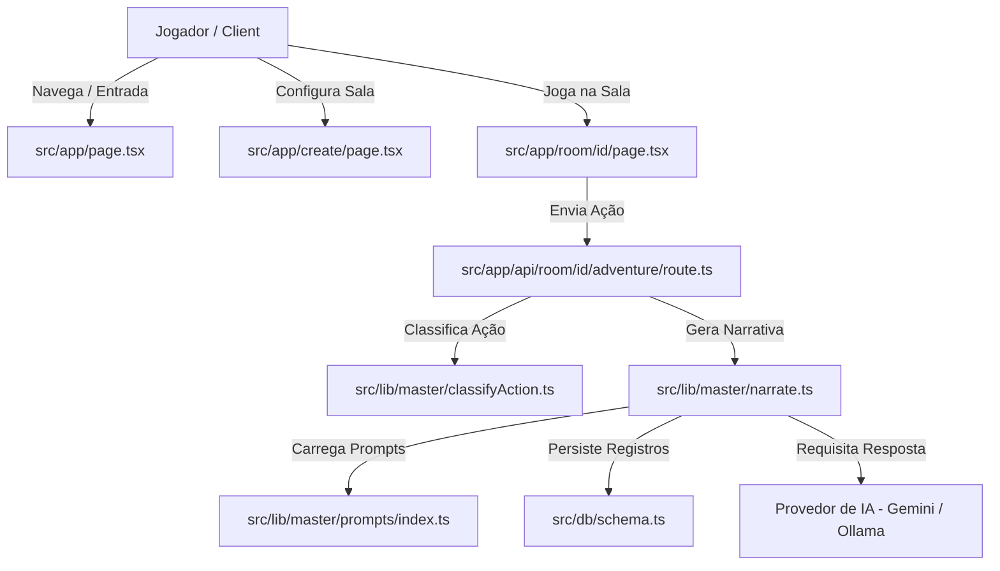

# RPGMO

**RPGMO** é uma plataforma web para partidas de RPG de mesa multiplayer online onde o papel de Mestre da partida é desempenhado por uma Inteligência Artificial (suportando provedores como Google Gemini, Ollama, Anthropic, entre outros).

---

## Funcionalidades Principais

- **Criação e Gestão de Salas:** Salas personalizadas protegidas por senha com código único de acesso.
- **Modelos de Mundos e Sistemas de Regras:** Suporte a cenários pré-definidos (Fantasia Medieval, Terror) ou carregamento de livros e mundos customizados.
- **Mestre IA Configurável:** Escolha o provedor de IA (Gemini, Ollama), ajuste parâmetros como criatividade (temperatura), tamanho do contexto e personalidade do Mestre.
- **Motor de Jogo & Narrativa Dinâmica:** Classificação inteligente de ações dos jogadores (combate, diálogo, uso de itens, espera) com prompts dinâmicos específicos.
- **Fichas de Personagem Completas:** Edição de atributos, recursos (HP, Mana), equipamentos, inventário e histórico do personagem.
- **Comunicação em Tempo Real:** Separada entre histórico de narração da aventura (In-Character) e chat livre (Out-of-Character) entre jogadores.

---

## Tecnologias Utilizadas

- **Framework:** Next.js 16 (App Router) + React 19 + TypeScript
- **Banco de Dados & ORM:** Drizzle ORM com @libsql/client (SQLite)
- **Provedores de IA:** @google/genai (Gemini), Ollama API, @anthropic-ai/sdk
- **Estilização:** Tailwind CSS + CSS Modules com estética Pixel Art

---

## Arquitetura do Sistema



---

## Mapa do Site e Telas

- **Home (`/`):** Acesso às salas existentes ou redirecionamento para criação.
- **Criar Sala (`/create`):** Configuração do cenário, mundo, regras e geração de código de acesso.
- **Sala de Jogo (`/room/[id]`):**
  - **Header:** Informações da sala, mundo, personagens e botão de salvar progresso.
  - **Coluna Esquerda (Personagens):** Seleção de personagem ativo, criação/edição de ficha e visualização de atributos (HP, Mana).
  - **Coluna Central (Narrativa da Aventura):** Histórico de ações e respostas do Mestre IA, opções de pausa, comandos (@personagem, #GM) e envio de ações.
  - **Coluna Direita (Chat de Amigos):** Comunicação livre Out-Of-Character (OC) entre jogadores.

---

## 🗂️ Estrutura do Projeto

```text
/src
├── app/
│   ├── api/                   # API Routes (auth, criação, aventura, chat, mestre)
│   ├── create/                # Página de criação e configuração de sala
│   ├── room/[id]/             # Tabuleiro principal da sala de jogo
│   ├── layout.tsx
│   └── page.tsx               # Página inicial e login em salas
├── components/                # Componentes React da interface
│   ├── Char.tsx               # Modal e formulário de ficha de personagem
│   ├── Create.tsx             # Formulário de criação de mundo
│   ├── Master.tsx             # Modal de configuração da IA Mestre
│   ├── RoomChars.tsx          # Painel lateral de personagens
│   ├── RoomChat.tsx           # Chat de bate-papo entre jogadores (OC)
│   ├── RoomHeader.tsx         # Cabeçalho da sala de jogo
│   └── RoomInAdventure.tsx    # Painel central da narrativa da aventura (IC)
├── data/                      # Modelos de mundos e dados estáticos
│   └── books/                 # JSONs com lore e regras (FantasiaMedieval.json, Terror.json)
├── db/                        # Camada de Banco de Dados
│   ├── index.ts               # Instância e conexão Drizzle ORM
│   └── schema.ts              # Definição das tabelas e relacionamentos
├── lib/                       # Lógica de negócio e integrações
│   └── master/                # Engine do Mestre IA (classificação, prompts e geradores)
└── types/                     # Definições de tipos TypeScript (adventure, room)
```

---

## Modelo de Dados

O banco de dados utiliza Drizzle ORM (SQLite) com as seguintes tabelas:

| Tabela | Descrição |
| :--- | :--- |
| `rooms` | Armazena o ID único da sala, hash da senha e datas de atividade. |
| `adventures` | Guarda o estado da partida, contexto geral, linha do tempo e ID do mundo. |
| `worlds` | Contém regras, cenários, lugares, NPCs, monstros e itens do mundo. |
| `masters` | Configurações do Mestre IA (provedor, modelo, apiKey, temperatura). |
| `characters` | Cadastro e fichas dos personagens dos jogadores. |
| `character_status` | Atributos e recursos dos personagens (Força, HP, Mana). |
| `character_items` | Equipamentos e inventário dos personagens. |
| `adventure_logs` | Histórico de ações e narrações In-Character (IC). |
| `chat_messages` | Bate-papo Out-Of-Character (OC) dos jogadores. |

---

## Executando o Projeto Localmente

### Pré-requisitos
- Node.js 18+
- Instância do Ollama rodando localmente (se usar IA local) ou Chave de API do Gemini/Anthropic.

### Passo a Passo

1. **Instalar dependências:**
   ```bash
   npm install
   ```

2. **Configurar variáveis de ambiente:**
   Crie um arquivo `.env` com as chaves necessárias para o banco de dados e APIs de IA.

3. **Gerar e aplicar schema do banco de dados:**
   ```bash
   npx drizzle-kit push
   ```

4. **Iniciar o ambiente de desenvolvimento:**
   ```bash
   npm run dev
   ```

Acesse [http://localhost:3000](http://localhost:3000) no seu navegador.

## Mapa do Site

- `Home (/ )`: Acesso à sala ou navegação para criação.
- `Criar Sala (/create)`: Configuração do cenário e regras da partida.
- `Configurar Mestre (/master)`: Configuração do Mestre (IA).
- `Sala (/room/[id])`: O tabuleiro principal do jogo.
- `Personagem (/room/[id]/[char])`: Criação e edição de fichas de personagem.


## Home

Página simples com botão login e criar sala


## Criar sala

O menu é composto por:

- Nome da sala: Escolha um.
- Senha: a senha que será usada para os jogadores entrarem.
- Mundo: Escolha o modelo do jogo.
    - label select com opções genéricas prontas tipo "fantasia medieval, cyberpunk".
    ou
    - selecione "personalizado" e suba seu livro D&D ou Tormenta.
- Personalização do mundo (opicional): Uma caixa chamada para personalizar o mundo escolhido ou criar um do zero.
- Botão Criar Sala: um código único será gerado (usado para o login).


# Configurar Mestre

Formulário para configurar o Mestre.
Campos:
- IA (gpt, gemini, claude).
- chave API.
- Personalidade do Mestre.


## Sala

Ambiente com:
- Header: nome da sala. 
    Expandível para mostrar os detalhes: id da sala, mundo, personagens e botão Salvar Aventura.
- 3 colunas: personagens, ChatIAventura, ChatAmigos


# Personagens:

- 3 funções: 
1. Criar personagem: leva a próxima página "Personagem".
2. Selecionar personagem disponível: Uma label select que mostra os personagens disponíveis.
3. Stats dos personagens escolhidos. Tem o HP, Mana, etc. Se clicar em expandir, vai para a tela de "Personagem", mas com campos 'nome', 'idade', etc já preenchidos e podendo ser modificados.

# ChatIAventura:

A IA vai receber as configurações do Mestre, o mundo (história, regras e personalização), os personagens, log da Aventura (se houver) e começar a aventura.

Interface:
- Engrenagem (configurações): Alterar as configurações do mestre.
- Botão play/pause: ativa/desativa o estado de pausa.

Estado de pausa: neste momento todos os jogadores podem fazer perguntas, interagir entre si e com o mundo e até modificar a aventura. O Mestre só vai continuar quando apertar o botão "Play".

Barra de mensagem:
- label personagem: escolha qual dos personagens vai realizar a ação.
- campo de texto: área de comunicação com o Mestre.

Comandos:
- @fulano -> direciona sua ação à personagem 'fulano'.
- #GM -> o que for escrito vai ser considerado como verdade. Função para jogadores personalizarem a aventura.


# ChatAmigos:

Um chat simples com texto ou voz. A IA não vai receber nada daqui.


## Personagem

Uma tela para criação ou edição de personagem.

# Campos:
- imagem: 32x32 pixels (editavel)
- nome:
- idade:
- classe:
- raça:
- status: label para distrubuição (editaveis)
- equipamento: 
- pertences:
- história:

Botões: Cancelar e Salvar


## Mapa do código:

/src
  - /app
    - /api (routes)
    - /create
      - page.tsx (página para criação de sala)
    - /room 
      - [id]
        - page.tsx (página da sala)
    - layout.tsx
    - page.tsx (página de login)
  - /components
    - Char.js (Modal para criação/edição de char)
    - Create.js (Componente para criação de sala)
    - Master (Modal para edição da IA_Mestre)
    - RoomAdventure.js (Componente para coluna central da sala)
    - RoomChars.js (Componente para coluna esquerda da sala)
    - RoomChat.js (Componente para coluna direita da sala)
    - RoomHEader.js (Componente para o Header da sala)
  - /css
    - /fonts (fontes utilizadas)
    - globals.css
  - /data
    - /livros (json's com história prontas para jogar)
    - /rooms  (json's com dados das salas criadas) - descontinuado
    - rooms.json (lista das salas criadas)
  - /db
    - index.ts
    - schema.ts (estrutura da db)


## Estrutura

O jogo é feito em duas camadas: sem IA e Com IA

# motor do jogo
a camada sem IA entra primeiro, funciona como um motor de jogo que vai funcionar como um jogo de rpg em turnos. ELe vai identificar se ta em fase de combate, seleção de dados, narração, etc.

# Mestre
a segunda camada com IA teria 3 fases: identificação, seleção, narração.
- a IA recebe a ação do player e um mestre identifica 
- uma seleção escolhe o tipo de ação "ação simples, combate, conversar, etc" e avisa a outra camada o estado do jogo
- baseado nesse estado, um prompt específico para essa ação específica. Se for combate, o prompt vai ter as regras do jogo, se for conversa, o prompt vai ter a personalidade do npc
